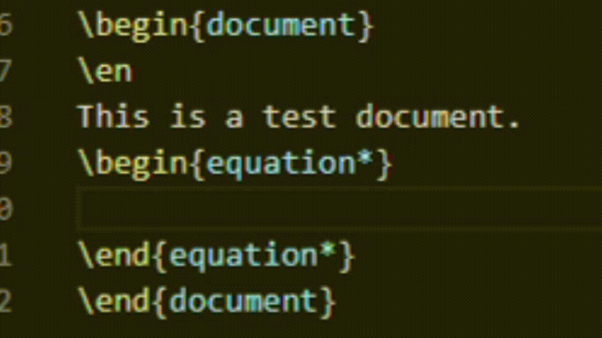
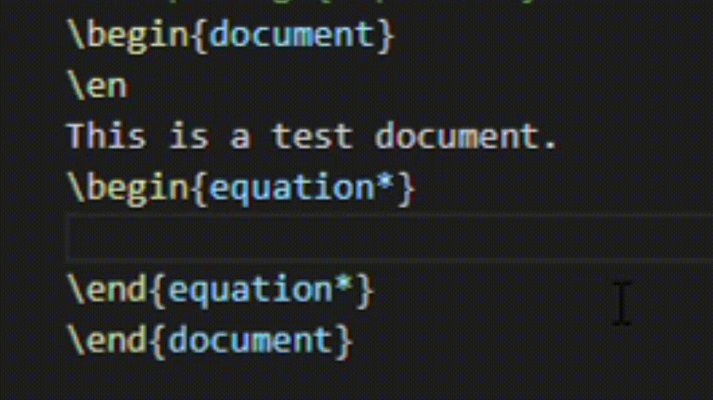
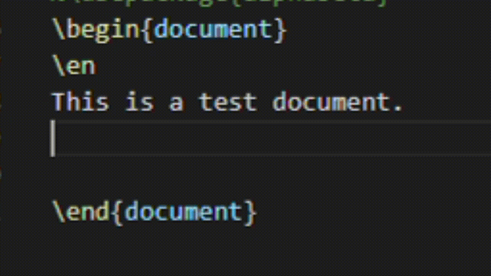
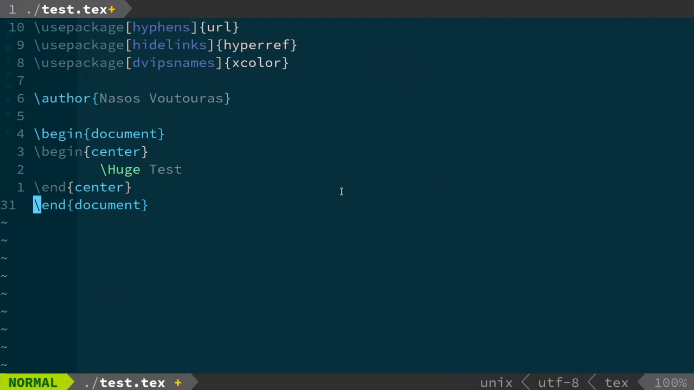

## Introduction

The purpose of this text is to provide doable instructions for more efficient mathematical (or not) text \"production\" via the use of snippets. I aim for it to be as short and to-the-point as possible and at the same time accessible to anyone who has a need for a more efficient alternative to MS Word/LibreOffice for technical documents. For a more detailed and technical approach, visit [[1]](https://castel.dev/post/lecture-notes-1/).

Now, what are snippets? You can think of snippets as text-shortcuts: some text that expands to a pre-defined piece of text or code when called/triggered. What this means is that you can substitute repeating code or text blocks with shorter key-words which when triggered, will expand to give us the output we want.

## Requirements

The standard way of creating technical documents is of course via $\LaTeX$. Another tool that only just recently came to my attention is
**groff** which is minimal, simplistic and very fast but the syntax can be tedious at times so I won\'t be showing any of it for the time being. Here we will be using the $\LaTeX$ system which, conveniently, shares its mathematics syntax with Markdown (technically the other way around).

You can find $\LaTeX$at the following links:

-   [MikTeX](https://miktex.org/) for Windows
-   [TeXLive](https://www.tug.org/texlive/) for Windows and Linux. On
    Linux install it using your distribution\'s package manager:
    -   For Debian based distro\'s: `sudo apt install texlive-full`
    -   For Red Hat/Fedora: `sudo dnf install texlive-scheme-full`
    -   For Arch: `sudo pacman -S texlive-core` or `texlive-most`. See
        the [wiki](https://wiki.archlinux.org/index.php/TeX_Live) for
        more info.

**Tip**:If you have no previous experience with $\LaTeX$, you can use Markdown which is much simpler and easier to learn. A good starting point would be [Typora](https://typora.io/) which is pretty much ok except for the fact that the developer hasn\'t released the code to the public. A libre alternative that I\'ve used is [UberWriter/Apostrophe](https://gitlab.gnome.org/somas/apostrophe). These programs don\'t support snippets as far as I\'m aware but they\'re ok for casual writing.

Lastly, we will need a text editor that can actually support snippets. Microsoft\'s [Visual Studio Code](https://code.visualstudio.com/) is easy to learn and provides all the necessary tools with just a few clicks. My new favorite editor is vim which is highly customizable and lightweight. Where it really shines though, is the keyboard based workflow. We will go over both of these starting with Visual Studio Code. I use the OSS version which is installed via flatpak but any version would work. I suggest the official download since you don\'t need any additional post-installation setup.

## Snippets in Visual Studio Code

Firstly we need to download the \"language\" support extensions for $\LaTeX$and/or Markdown. From the activity bar (on the left) click on the `Extensions` button and search for Markdown and $\LaTeX$ use the **LaTeX Workshop** by James Yu and **Markdown All in One** by Yu Zhang. These two can provide proper colouring and a few other features. Now, **LaTeX Workshop** provides its own snippets which you might want to use (or not). In any case we will be creating our own as the ones provided require the use of <kbd>@</kbd> which I personally find a bit hard to hit while trying to type fast. Τhe structure autocomplete helps a lot though.

### Settings

Since we are aiming for efficiency, we need to be able to trigger snippets as fast and easy as possible. To achieve this we need to change the default setting of not showing suggestions (therefore not allowing us to trigger the snippets) inside other snippets (see gif). As you can see when I trigger the `\dv` snippet the first argument doesn\'t work but the second does:

<!--{width="320" height="180"} -->

Press <kbd>Ctrl </kbd>+ <kbd>Shift</kbd> + <kbd>P</kbd>, type `settings` and
select `Open Settings (JSON)`. Add the following line inside the
brackets:

    {
        "editor.suggest.snippetsPreventQuickSuggestions": false 
    }

My settings have some additional lines:

    {
        "latex-workshop.view.pdf.viewer": "tab",
        "files.autoSave": "off",
        "editor.suggest.showWords": false,
        "editor.tabCompletion": "onlySnippets",
        "editor.snippetSuggestions": "top",
        "editor.suggest.snippetsPreventQuickSuggestions": false,
        "telemetry.enableTelemetry": false
    }

<!-- {width="320" height="180"} -->

### Creating snippets

Before we start writing custom snippets we need to think about what we need to automate. Take a look at the **LaTeX Workshop** [manual](https://github.com/James-Yu/LaTeX-Workshop/wiki/Snippets) where there\'s a list of all the available snippets. You can see that it can easily take care of structure environments like `begin{equation*}` with `bseq` <kbd>Tab</kbd> (you don\'t actually have to type `bseq`, it can be triggered with `bse` + <kbd>Tab</kbd>).

<!-- {width="320" height="180"}
-->
Since Dirac's notation is pretty common and useful we\'ll try to make some snippets for it. We\'ll avoid the `physics` package commands to make the expressions render even without including the package in the preamble. As you can see from the GIFs, I have also automated the commands for Greek letters $\psi,\Psi$ and the partial derivatives.

Now, we will write snippets for

- Some Greek letters
- Dirac's matrix element:$\langle\psi _n \|\hat{V}\| \psi_m\rangle$
- Partial derivatives

Hit<kbd>Ctrl</kbd> + <kbd>Shift</kbd> + <kbd>P</kbd> and type `snippets`.
Select the `Configure User Snippets` option and type latex (or markdown). You now have opened the `latex.jason` file which we will edit. As you can see there are instructions on how to create simple snippets. Lets begin with the Psi\'s.

The main structure of the snippets is

    "Title": {
        "prefix": "-triggering sequence-",
        "body": [
            "-The output-"
        ],
        "description": "-a description-"
    }

We need to be careful not to forget the escape character"`\`" when we require `\` to to be in our output expression. The $\psi$ snippet would be:

    "psi": {
        "prefix": "psi",
        "body": [
            "\\psi "
        ],
        "description": "Lowercase Greek psi"
    }

Save the `latex.json` and create a new `.tex` file to test that it works. Now, let's get on with the next one: $\langle \psi_m \|
\hat{V} \| \psi_n \rangle$. For this snippet we will use tab stops (dollar signs) which will allow us to jump onto the next stop by pressing <kbd>Tab</kbd>. We will use three tab stops for the main math commands plus one more right after them so the next <kbd>Tab</kbd> press can get us out of the expression:

    "Matrix Element": {
        "prefix": "mel",
        "body": [
            "\\langle \){1:\\psi_m} | \){2:operator} | \){3:\\psi_n} \\rangle \)0 "
        ],
        "description": "matrix element of an operator"
    }

Now that you've seen how it works, the partial derivative snippet should make perfect sense:

    "Partial Derivative": {
            "prefix": "pdv",
            "body": [
                "\\frac{\\partial \)1 }{\\partial \){2:x}} \)0"
            ],
            "description": "Partial der with the option to leave the function out of the numerator"
        }

## Snippets in vim

Snippets in vim are much more efficient but require a bit of tinkering and some simple python knowledge. Of course, I didn\'t reinvent the wheel. I borrowed a few lines of code from the sources. Nevertheless, I will try to explain the whole process of implementing the use of snippets in vim from the very beginning.

### Plugins

Before we can begin writing our snippets we need to install a plug-in that will allow us to actually use them. We can of course modify the `.vimrc` file to map specific patterns to user-specified outputs but I prefer UltiSnips for it\'s simplicity and its seamless implementation of python & regular expressions.

To install UltiSnips we need a plug-in manager for vim. I use [vim-plug](https://github.com/junegunn/vim-plug). Using the instructions provided, one can very easily install the addon manager.

**For Linux:** Add these lines to your `.vimrc` to install UltiSnips (the commands below set the <kbd>Tab</kbd> key as the trigger and the \"jump forward\" button):

    call plug#begin('~/.vim/plugged')
    Plug 'SirVer/ultisnips'
        let g:UltiSnipsExpandTrigger = ''
        let g:UltiSnipsJumpForwardTrigger = ''
    call plug#end()

Open vim and type `:PlugInstall` to install the UltiSnips plugin. When you\'re done, create a new directory in .vim/ called UltiSnips. Inside the new directory, create a new (text) file called `tex.snippets`. This is where all of our snippets will be stored.

### Simple snippets

Inside the file we\'ve just created (`tex.snippets` in `$HOME/.vim/UltiSnips/` on Linux) write the following:

    snippet eqq "display equation" bA
    \\begin{equation*}
        \)1
    \\end{equation*}
    \)0
    endsnippet 

This snippet will automatically expand `eqq` to the unnumbered equation environment (`\begin{equation*} [...] \end{equation*}`) and place the cursor where the tabstop is located.

Let\'s take a look at the syntax. Each snippet begins with `snippet` followed by the expression that triggers it (in our case, `eqq`). Then, inside the quotation marks, we write a small description and finally, at the end of the line, the required options. Here, we have `b`, which stands for \"beginning\" (of the line) and `A` for \"automatic\" (expansion). These two options do the following: expand the snippet automatically whenever we type `eqq` at the beggining of a line. There is no need to press  <kbd>Tab</kbd>. Using the `A` option and some python we can write formulas in $\LaTeX$ as fast as when using pen and paper.

The `w` option along with `A` will automatically trigger the snippet if it\'s not appended to a word (i.e. has white space behind it).

<!--{width="768" height="432"}-->

The nonsensical expression in the gif was typed, as one can see, pretty fast. We also saved tons of keystrokes. We can get deeper by using python and regular expressions but the \"short\", \"doable\" for beginners instructions that were promised at the beginning of the text would be turned into a nightmarish looking series of various symbols that appear to have no meaning whatsoever other than to intimidate the reader. The \"code\" for the two snippets (the `begin` one was shown above) is listed below:

    snippet lint "integral with limits" A
    \\int_{\)1}^{\)2} \)0
    endsnippet
    
    snippet sum "sum"
    \\sum_{\){1:n = 1}}^{\){2:N}} \)0
    endsnippet

There is a caveat using the above: the `lint` will expand automatically even in normal text mode. We don\'t want that. The sources listed below provide several insights on the matter (you can just copy-paste their code and you\'ll be fine). The thing is that these solutions won\'t work 100% of the time, at least using a default setup. This is because they use vim\'s highlighting to figure out when we are inside math-mode or not and, by default, the AMS\'s modes aren\'t listed in the syntax files (`tex.vim` in `usr/share/vim/vim8*/syntax/`). So, one needs to get the [syntax files](http://www.drchip.org/astronaut/vim/index.html#LATEXPKGS) \[3\], \[4\] that add AMS support and everything will (probably) work fine.

Anyways, in order to have the math-mode snippets expand only in math-mode, we need to use the `context` functionality provided by UltiSnips (provided we have **already defined the said context in our
`tex.snippets` file):**

    context "math()"
    snippet lint "integral with limits" A
    \\int_{\)1}^{\)2} \)0
    endsnippet

where we\'ve used the `math()` environment as defined in [[1]](https://castel.dev/post/lecture-notes-1/), [[2]](https://vi.stackexchange.com/questions/18490/ultisnips-context-and-tex). This way, the snippets will only expand while we\'re inside inline or display math-mode (works with `eqnarray` by default but not with AMS\'s `\begin{align}` ).

For the most advanced users, I strongly advise reading Mr. Castel\'s blog posts where he explains the more complex stuff in detail and also provides tips for even faster $\LaTeX$ writing, focusing primarily on fast note-taking.

I hope this wasn\'t too intimidating,

Nasos

## Further Reading and Sources:

-   \[1\] <https://castel.dev/post/lecture-notes-1/>
-   \[2\] <https://vi.stackexchange.com/questions/18490/ultisnips-context-and-tex>
-   \[3\] <http://www.drchip.org/astronaut/vim/index.html#LATEXPKGS>
-   \[4\] <https://tex.stackexchange.com/questions/416030/how-do-i-make-vim-highlight-math-properly-in-the-align-environment>

------------------------------------------------------------------------

-   UltiSnips Documentation: <https://github.com/SirVer/ultisnips/blob/master/doc/UltiSnips.txt>
-   Vim-Plug: <https://github.com/junegunn/vim-plug>
-   Snippets in VSCode: https://code.visualstudio.com/docs/editor/userdefinedsnippets
-   SirVer\'s (Holger Rapp) website, creator of UltiSnips: <https://www.sirver.net/>
-   The best guides for ultra fast TeX and graphics: <https://castel.dev/>
